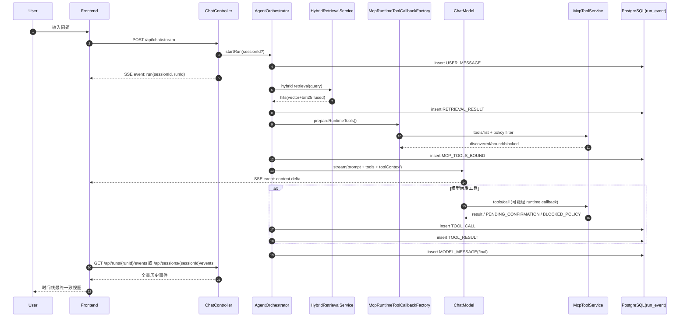

# Agent-MM

> 目标：把项目当前实现、技术决策、可优化方向和横向对比整理成“可直接回答面试官”的素材。

## 1. 项目定位与架构一句话

这是一个面向 AI Agent 工程化的 monorepo MVP：后端用 Spring Boot + Spring AI（DashScope）做编排、工具调用和 RAG，当前 provider 用的是 Spring AI Alibaba。这样既利用阿里生态能力，也保留后续切换模型供应商的接口兼容性。前端用 Vue3 展示流式对话与运行时间线，PostgreSQL 持久化 run/event 以支持回放、排障和后续评测。

---

## 2. 对话链路（SSE + Run Trace）

### 当前实现

- 入口接口：`POST /api/chat/stream`，通过 SSE 推送 `run` 和 `event`。
- 每次请求创建 `runId`，可复用 `sessionId` 进行多轮对话。
- 持久化核心事件：`USER_MESSAGE`、`MODEL_MESSAGE`、`TOOL_CALL`、`TOOL_RESULT`、`RETRIEVAL_RESULT`、`RAG_SYNC`、`ERROR`。
- 历史查询支持 run 维度与 session 维度：`/api/runs/{runId}/events`、`/api/sessions/{sessionId}/events`。

### 可优化点

- 增加 trace 过滤与分页（按 event type、时间区间、session）。
- 增加请求级指标（首 token 延迟、总耗时、工具调用耗时）。
- 从“仅事件回放”升级到“可视化链路诊断”（类似 mini APM）。

### 技术选型与横向对比

| 方案 | 当前选择 | 优势 | 代价 |
|---|---|---|---|
| 流式协议 | SSE over POST | 浏览器和网关兼容性好，实现简单 | 单向通道，不适合复杂双向协商 |
| 追踪存储 | 事件落库（JSON payload） | 天然可回放、可观测、可审计 | 需要做事件 schema 治理 |
| 会话记忆 | session 聚合历史并裁剪窗口 | 成本低，足够支撑 MVP 多轮 | 长上下文质量受限 |

---

## 3. Tool Calling（本地工具闭环）

### 当前实现

- 通过 Spring AI 工具机制接入本地工具（如 `now`、`add`、`get_weather`）。
- 编排器统一注册工具，模型可自动决策调用。
- 工具调用与结果均写入事件流，可在时间线回放。

### 可优化点

- 增加工具级超时、重试和熔断策略。
- 工具参数做更严格校验（schema + 边界检查）。
- 引入工具权限分级（按环境、按用户、按会话白名单）。

### 技术选型与横向对比

| 方案 | 当前选择 | 优势 | 代价 |
|---|---|---|---|
| 工具接入 | 本地 `@Tool` + 统一注册 | 开发快，调试链路短 | 扩展到外部系统时治理压力上升 |
| 工具可观测 | `TOOL_CALL/TOOL_RESULT` 事件化 | 问题定位清晰 | 需要定义 payload 兼容策略 |
| 上下文传递 | ToolContext | 流式线程切换更稳 | 需要约束上下文键命名 |

---

## 4. RAG：当前做到哪里了

### 当前实现

- 数据源：本地 `docs/**/*.md` + URL 文档源。
- 预处理：Markdown 分块（标题路径、段落切分、稳定 chunkId）。
- 召回：BM25 + 向量检索（pgvector）并行，RRF 融合得到最终 topN。
- 同步：按 `content_hash + embedding_model + embedding_version` 做增量更新，支持 upsert + 软删除。
- 可观测：`RETRIEVAL_RESULT` 记录 strategy、向量/BM25 命中数、最终命中数和样本来源。

### 可优化点（你面试可以重点讲）

1. **重排器（Reranker / Cross-Encoder）**
   - 现状：RRF 主要依赖召回排名，语义精排能力有限。
   - 目标：对候选片段做二阶段精排，提高 Top1/Top3 准确率。

2. **可追溯回答（Citation）**
   - 现状：可看到文档路径和事件，但回答未强绑定引用片段。
   - 目标：回答结构化输出 `answer + citations[]`（chunkId/snippet/score）。

3. **查询改写（Multi-Query / HyDE / Decomposition）**
   - 现状：单 query 检索，复杂问题容易漏召。
   - 目标：改写后并行召回并融合，提高 recall。

4. **离线评测体系**
   - 现状：有可观测日志，但缺少稳定离线指标闭环。
   - 目标：建立 Recall@K、MRR、nDCG、答案可归因率等基线。

### 技术选型与横向对比

| 维度 | 当前方案 | 可升级方案 | 对比结论 |
|---|---|---|---|
| 关键词召回 | BM25（自实现） | Elasticsearch/OpenSearch BM25 | 当前足够轻量，规模上来后可迁移搜索引擎 |
| 语义召回 | pgvector + embedding | 专用向量库（Milvus/Weaviate） | 现阶段用 PG 一体化性价比高 |
| 融合 | RRF | 学习排序/重排模型 | RRF 稳定易解释，重排提升上限更高 |
| 更新策略 | 增量同步 + 软删除 | 事件驱动 CDC + 分层索引 | 当前简单可靠，后期可做实时化 |

---

## 5. URL Source 与条件请求（ETag）

### 当前实现

- URL 抓取支持 `If-None-Match` / `If-Modified-Since` 条件请求。
- 同步状态支持 `SUCCESS/FAILED/NOT_MODIFIED/...`。
- 已修复关键问题：当 304 或抓取失败时复用已有 chunk，避免误软删除导致“文档读不到”。
- 增加了 URL 同步日志：每个 source 的同步结果、复用 chunk 数、总 chunk 数。

### 可优化点

- 支持 sitemap 和站点爬取策略（同域、深度、页数、白名单）。
- 增加 canonical 去重与正文提取质量控制（boilerplate 去除）。
- 建立抓取队列（优先级、重试、退避、死信队列）。

### 技术选型与横向对比

| 方案 | 当前选择 | 优势 | 代价 |
|---|---|---|---|
| 抓取模式 | 单 URL 拉取 | 可控、简单、稳定 | 覆盖面受限 |
| 缓存协商 | ETag/Last-Modified | 带宽与同步开销低 | 首次冷启动仍需全量 |
| 文本抽取 | 简化清洗（HTML 去标签） | 快速落地 | 正文质量受页面结构影响 |

---

## 6. MCP 现状与“Python 爬虫 MCP”方向

### 当前实现

- 聊天主链路已支持 MCP 工具动态注入（runtime callback），不是仅靠固定桥接函数。
- 已支持治理参数：`allow-tools`、`deny-tools`、`max-callbacks`。
- 新增 `MCP_TOOLS_BOUND` 事件，记录注入、拦截与发现错误。
- `run_local_command` 已加入确认网关：变更类命令走 `PENDING_CONFIRMATION`，可确认/拒绝。
- 前端已提供 pending action 操作入口，确认后会触发 follow-up 并把执行结果喂给模型总结。

### 为什么 Python 适合做 crawler MCP

- 生态成熟：`httpx`、`beautifulsoup4`、`readability-lxml`、`trafilatura`。
- 迭代快：抓取策略、解析规则和反爬兼容通常 Python 更高效。
- 易服务化：可独立部署为 MCP server，被 Java 编排层调用。

### 推荐的 MCP 工具设计（面试可讲）

- `search_docs(query, topK)`：搜索入口。
- `fetch_page(url)`：返回正文、标题、links、etag、lastModified。
- `enqueue_ingest(url, source)`：异步入库任务。
- `get_ingest_job(jobId)`：查询任务状态。

> 关键原则：让 Agent 在“受控策略”内选链接，不是无限自由爬取。

---

## 7. 前端控制台能力

### 当前实现

- Chat 区支持流式增量展示。
- Inspector 拆分状态/RAG/时间线/工具面板。
- 时间线支持 session 级历史回放。
- 最新调整：模型输出中不展示流式 delta 时间线，结束后统一刷新历史事件。

### 可优化点

- 时间线筛选（按 event type）和聚合视图（同类事件折叠）。
- 前端增加 run 诊断看板（token 延迟、检索命中、工具成功率）。
- 引用卡片化展示（回答片段可跳转至来源 chunk）。

---

## 8. 主流还没做但值得做的点（可作为 roadmap）

1. Reranker（二阶段精排）。
2. 回答引用（可追溯与可验证）。
3. 查询改写（多路召回融合）。
4. Prompt/检索评测平台（离线集 + 自动回归）。
5. 多租户隔离与权限模型（企业场景必问）。
6. 成本治理（token、embedding、工具调用成本可视化）。

---

## 9. 面试高频问答模板（可直接背）

### Q1：为什么用“事件落库”而不是只存最终回答？

我把运行过程拆成事件流，是为了让系统具备可观测和可回放能力。只存最终回答很难排查“模型为什么这么答”，而事件化后可以看到检索命中、工具调用和错误链路，便于定位问题和后续做评测。

### Q2：为什么混合检索用 RRF？

RRF 对不同召回通道（BM25 和向量）的分数尺度不敏感，融合稳定、实现简单，适合 MVP 快速落地。后续再引入重排器提升上限。

### Q3：软删除的价值是什么？

软删除可以降低误删风险，尤其是 URL 同步中出现 304、临时失败、数据源抖动时，不会立刻丢失知识。它更像“下线”而不是“抹掉”，有利于故障恢复和审计。

### Q4：你如何保证 RAG 结果可信？

目前通过检索事件可观测和来源记录保证可追踪，下一步会补齐回答级 citations，让每段答案都能回溯到具体 chunk/snippet。

---

## 10. 我自己的下一步（建议你每周更新）

- 本周：做 3 个可演示场景（纯聊天、多轮记忆、MCP 待确认命令）。
- 下周：补一份“run 事件解剖”案例（从 USER_MESSAGE 到 TOOL_RESULT）。
- 本月：补 citations + reranker 二选一，先完成一个形成闭环 demo。

> 维护建议：每完成一项功能，按“问题背景 -> 方案权衡 -> 落地细节 -> 结果指标 -> 复盘”追加 10~20 行，长期就是你的高质量面试素材库。

---

## 11. 学习优先级（先学路线，再做优化）

如果目标是“先把 Agent 技术路线学扎实”，建议按下面顺序推进：

1. **先吃透主链路（必须）**
   - 一次对话从请求进入到 run/event 落库再到前端展示的全路径。
   - 能画出时序图并解释每类事件的价值（可观测、回放、审计）。

2. **再吃透工具调用治理（高优先）**
   - 模型如何选工具、工具如何记录事件、为什么要确认网关。
   - 能讲清“安全 vs 可用性”权衡：哪些命令硬拦截，哪些允许确认后执行。

3. **然后吃透 RAG 闭环（高优先）**
   - 分块、召回、融合、注入 prompt、事件观测。
   - 能回答“为什么先用 RRF，何时需要 reranker”。

4. **最后再做优化项（可暂缓）**
   - 如 citations、reranker、query rewrite、评测平台、成本治理等。
   - 这些属于“提上限”的工作，不是“懂主链路”的前置条件。

一句话策略：**先把 0->1 跑通并讲明白，再做 1->10 的优化。**

---

## 12. 一次完整 Run 解剖（可口述 + 可画图）

> 场景：用户问“帮我看一下 k8s 集群状态”，模型可能会检索文档并调用工具。

### 12.1 口述版（面试 60~90 秒）

1. 前端调用 `POST /api/chat/stream`，后端先 `startRun` 创建/复用 `sessionId` 并生成 `runId`。
2. 编排器先落一条 `USER_MESSAGE`，保证输入可追踪。
3. 进入 RAG：hybrid 并行做 BM25 + 向量检索（向量用 embedding 后相似度召回），融合后记录 `RETRIEVAL_RESULT`。
4. 编排器组装 prompt（历史上下文 + 检索参考 + 当前问题），并准备工具：本地 tools + 运行时发现的 MCP tools。
5. 先落 `MCP_TOOLS_BOUND`，记录本轮注入/拦截/发现错误，再进入模型流式生成。
6. 生成过程中如果触发 tool call，会写 `TOOL_CALL` / `TOOL_RESULT`；若是 `run_local_command`，命中策略会返回 `PENDING_CONFIRMATION` 或直接 `BLOCKED_POLICY`。
7. 前端实时显示模型增量文本，后台轮询 run events 同步时间线；流结束后后端落最终 `MODEL_MESSAGE`，前端刷新历史事件并收敛为最终视图。

### 12.2 时序图（可直接贴到面试文档）

### 12.3 你这段理解的校正点

- 你对 hybrid 的理解是对的：BM25 走词项匹配，向量走 embedding 相似度，最后融合。
- 你说“模型根据输出决定调用什么 tool”也对，但更准确是：模型在生成过程中基于上下文做 tool decision。
- 危险命令流程也对：`run_local_command` 先过策略门，可能 `PENDING_CONFIRMATION`，也可能硬拦截。

---

## 13. 为什么你项目里 `skill` 是 tools，而别人是 MD + 脚本

这是两个层面的“skill”，名字一样，语义不同：

1. **Tool Skill（你项目当前）**
   - 在后端里，`skill` 包下是可执行能力，核心是 Spring AI `@Tool`。
   - 本质是函数调用接口，模型可直接调用并拿结构化返回。
   - 例如：`now`、`add`、`get_weather`、MCP bridge。

2. **Prompt Skill（你看到的别人项目）**
   - 常见形态是 `xxx.md + scripts/`，用于给模型“行为说明 + 渐进披露上下文”。
   - 本质是提示词工程与工作流模板，不一定是函数调用。
   - 更像“指导模型怎么做”，而不是“给模型一个可执行 API”。

一句话区分：**Tool skill 解决“能做什么”，Prompt skill 解决“该怎么做”。**

你现在这套工程化路线完全成立，而且很适合面试表达：
- 先把可执行能力做成 tool（可观测、可审计、可控）；
- 后续再补 prompt skill 层（任务分解、渐进披露、策略约束）。

---

## 14. Harness Engineering 视角：当前项目已经体现了什么

> 定位：Harness Engineering 的核心不是“让模型更聪明”，而是“给模型搭可控、可观测、可审计、可演进的执行底座（harness）”。

### 14.1 你项目里已经具备的 Harness 能力

1. **事件化执行轨迹（Execution Harness）**
   - 体现：run/event 持久化，关键事件可回放（`USER_MESSAGE`、`RETRIEVAL_RESULT`、`TOOL_CALL`、`TOOL_RESULT`、`MCP_TOOLS_BOUND`、`MCP_CONFIRM_RESULT`）。
   - 价值：不是黑盒“只看答案”，而是可追踪“为什么得出这个答案”。

2. **工具治理与策略门（Policy Harness）**
   - 体现：MCP 运行时工具注入 + allow/deny/max-callbacks；高风险工具 `run_local_command` 支持 hard block 和 pending confirm。
   - 价值：把 Agent 能力放在安全边界里运行，避免“模型想干啥就干啥”。

3. **人机协同确认闭环（Human-in-the-loop Harness）**
   - 体现：pending action -> confirm/reject -> 结果回写 run 事件。
   - 价值：关键动作可人工把关，满足生产场景合规与审计要求。

4. **混合检索编排（Retrieval Harness）**
   - 体现：hybrid（BM25 + 向量）+ RRF 融合；检索结果事件化记录命中统计和来源。
   - 价值：把“检索质量”从主观感觉变成可观测、可优化的流水线。

5. **前端观测控制台（Operator Harness）**
   - 体现：时间线、工具面板、RAG 面板、pending action 操作入口。
   - 价值：开发与运维不需要猜系统状态，具备运行期可操作性。

### 14.2 为什么这就是 Harness Engineering

你的系统已把 Agent 运行拆成了 5 个可治理层：

- **Input Harness**：消息入口 + session/run 组织；
- **Retrieval Harness**：召回与融合可观测；
- **Tool Harness**：工具接入、策略、确认网关；
- **Trace Harness**：事件落库、回放、审计；
- **Operator Harness**：前端控制台可观测与人工干预。

这正是 Harness Engineering 的典型形态：**把 LLM 放进可控系统，而不是把系统交给 LLM。**

---

## 15. 以 Harness Engineering 为重心的下一步实现计划

> 你指定的优先级：前端联调增强 > 事件 schema 固化 > 可观测指标（先不做测试任务）。

### 15.1 前端联调增强（Pending/Confirm 生命周期闭环）

目标：让 pending action 在 UI 上形成“出现 -> 处理 -> 收敛”的完整生命周期，不残留噪音。

实现步骤：

1. 在时间线层建立 `actionId` 维度状态机（`PENDING_CONFIRMATION` -> `CONFIRMED_EXECUTED` / `CONFIRM_EXECUTION_FAILED` / `REJECTED`）。
2. pending 列表与时间线共用同一份状态源，避免双份逻辑导致不一致。
3. confirm/reject 后自动收敛 pending 列表项，并在时间线保留最终结果 badge。
4. 对“确认接口成功但事件回写延迟”做短暂 optimistic 状态（例如处理中/同步中）。

交付标准：

- 一个 actionId 在界面上只保留一条最终状态；
- pending 区域不会出现已处理项“回弹”；
- 用户能从时间线一眼看出确认是成功、失败还是拒绝。

### 15.2 事件 Schema 固化（Event Contract）

目标：把 run_event 从“可写 JSON”升级为“有契约 JSON”，保证前后端演进稳定。

实现步骤：

1. 在文档中新增“事件契约表”，至少覆盖：`TOOL_RESULT`、`MCP_CONFIRM_RESULT`、`RETRIEVAL_RESULT`。
2. 约定每类事件的 `required` / `optional` 字段与枚举值（例如 `status`）。
3. 后端在事件写入前做最小字段完整性保护（缺关键字段时写默认值并标记 degraded）。
4. 前端 mapper 对未知字段降级展示，对关键缺失字段做兜底文案。

交付标准：

- 文档有可执行的事件契约；
- 后端新增字段不会破坏前端展示；
- 前端对“老 payload / 新 payload”都能兼容。

### 15.3 可观测指标（Metrics Harness）

目标：从“能回放”升级到“可量化运营”，最小化实现确认链路与工具链路指标。

实现步骤：

1. 后端增加轻量聚合接口（按时间窗口返回计数）：
   - `confirm_total`、`confirm_success_total`、`confirm_failed_total`、`confirm_rejected_total`；
   - `tool_call_total`、`tool_error_total`（可选按 toolName 分组）。
2. 前端 RunStatus 或 Timeline 面板增加指标卡片，默认展示近 24h。
3. 指标口径固定在文档中（统计口径、时间窗口、是否去重）。
4. 后续再接 Prometheus/OpenTelemetry，先保留接口兼容位。

交付标准：

- 控制台可直接看到确认成功率与失败量；
- 指标口径在文档中有明确说明；
- 运营/排障不再只靠逐条翻时间线。

### 15.4 执行顺序建议（本周）

1. 先做 15.2（Schema 固化）打地基；
2. 再做 15.1（前端联调增强）提升交互一致性；
3. 最后做 15.3（可观测指标）形成运营闭环。

一句话：**先立契约，再稳联调，最后上指标。**
